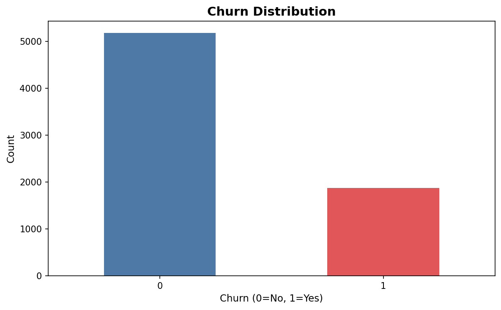
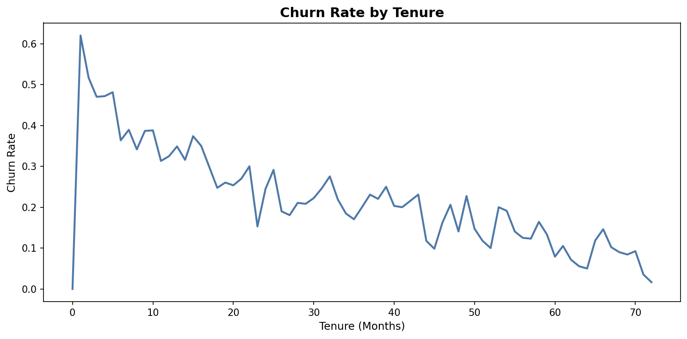
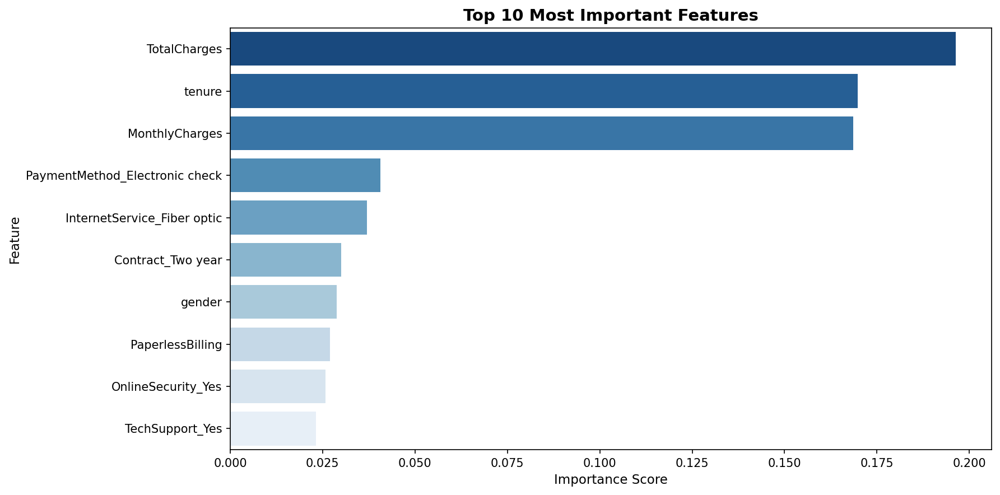
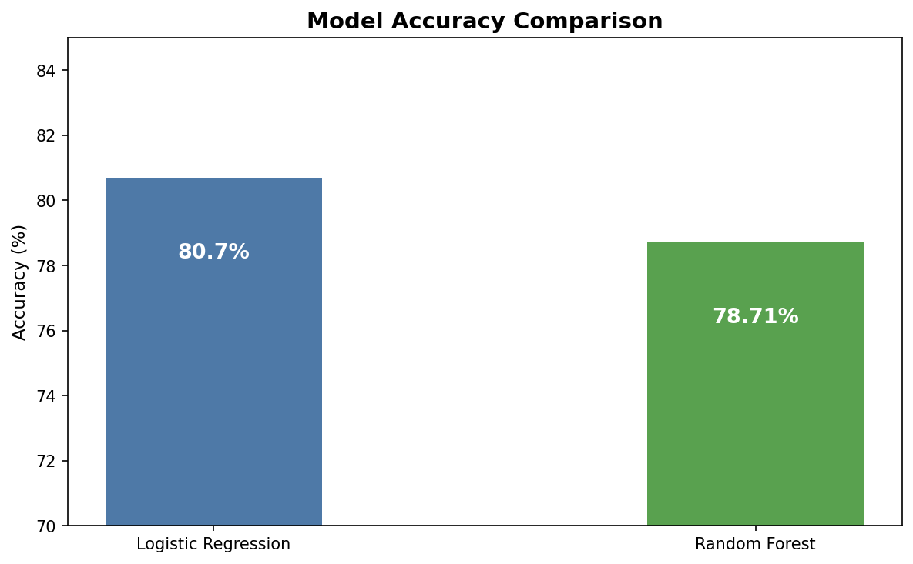
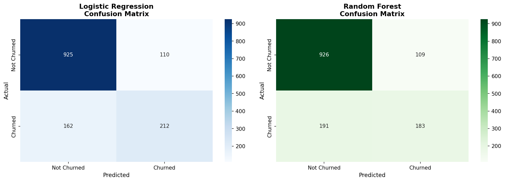

# Customer Churn Prediction — Python ML

## Project Overview
Built a machine learning model to predict which telecom customers 
are likely to churn using Logistic Regression and Random Forest 
classifiers, achieving 80.70% accuracy.

## Tools Used
- Python (Pandas, Numpy, Matplotlib, Seaborn) — EDA
- Scikit-learn — machine learning models
- Google Colab — development environment

## Dataset
- Source: [Telco Customer Churn — Kaggle](https://www.kaggle.com/datasets/blastchar/telco-customer-churn)
- Size: 7,043 customers, 21 features
- Target: Churn (Yes/No)

## Project Workflow
1. Data loading and inspection
2. Data cleaning and preprocessing
3. Exploratory data analysis
4. Feature encoding and scaling
5. Model building — Logistic Regression
6. Model building — Random Forest
7. Model evaluation and comparison
8. Feature importance analysis

## Model Performance
| Model | Accuracy |
| Logistic Regression | 80.70% |
| Random Forest | 78.71% |

Logistic Regression outperformed Random Forest — 
showing simpler models can be more effective on 
structured tabular data.

## Key Business Insights

1. **Tenure is critical** — Customers with less than 
   12 months tenure are most likely to churn. 
   Early retention programs are essential.

2. **Contract type matters** — Two year contract holders 
   churn significantly less than monthly contract customers.
   Incentivising longer contracts reduces churn.

3. **Fiber optic users churn more** — Possible service 
   quality or pricing issue worth investigating.

4. **Electronic check users** — Higher churn rate suggests 
   offering auto-pay discounts could improve retention.

5. **Senior citizens** — Higher churn rate indicates need 
   for dedicated customer support for this segment.

## Top Predictive Features
1. TotalCharges (0.196)
2. Tenure (0.170)
3. MonthlyCharges (0.169)
4. Electronic check payment (0.041)
5. Fiber optic internet (0.037)

## Visualisations

## Project Structure
├── customer_churn_prediction.ipynb  — full notebook
├── WA_Fn-UseC_-Telco-Customer-Churn.csv  — dataset
├── *.png  — all visualisation charts
└── README.md

## How to Run
1. Open customer_churn_prediction.ipynb in Google Colab
2. Upload WA_Fn-UseC_-Telco-Customer-Churn.csv
3. Run all cells in order
4. All charts save automatically
